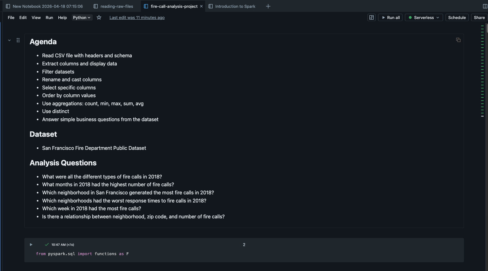
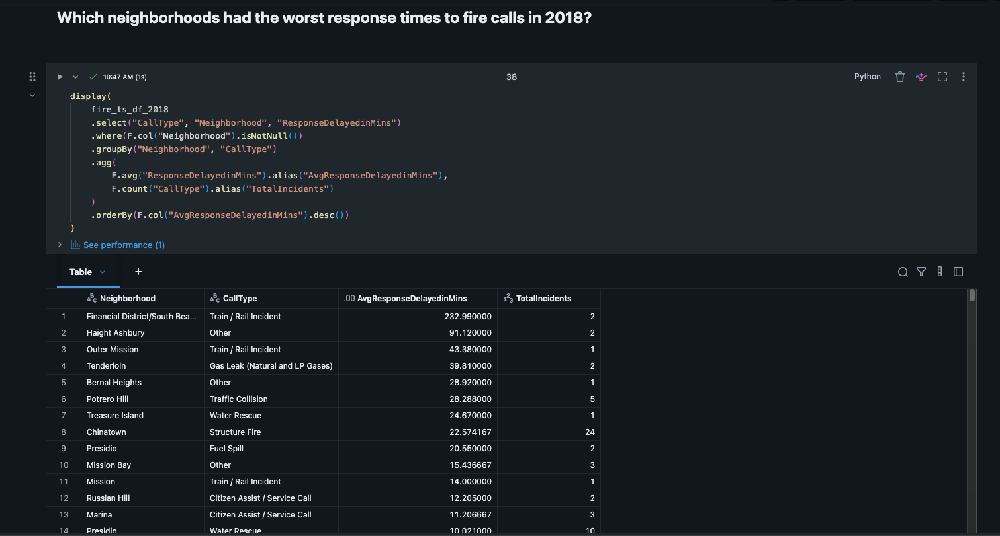

# Databricks Fire Calls Analysis

## Overview
This is a beginner Databricks + PySpark project that analyzes San Francisco fire call data using a CSV file stored in a Databricks Volume.

The goal of this project was to practice core data engineering concepts in Databricks, including reading raw data, filtering, transforming columns, casting timestamps, aggregating results, and persisting transformed output as Parquet.

---

## Tools & Technologies
- Databricks
- PySpark
- Databricks Volumes
- Python
- Parquet

---

## Dataset
- San Francisco Fire Department public fire calls dataset
- File stored in a Databricks Volume for this project

---

## Key Concepts Practiced

### 1. Reading CSV Data
Used Spark to read a CSV file with header and inferred schema.

### 2. Filtering and Selecting Columns
Selected relevant columns and filtered out medical incidents.

### 3. Renaming and Casting Columns
Created a cleaner response delay column and converted date/time strings into timestamp columns.

### 4. Aggregations
Used `groupBy()` and aggregation functions like:
- `count()`
- `avg()`
- `min()`
- `max()`
- `sum()`

### 5. Time-Based Analysis
Answered questions about fire calls in 2018 by month, neighborhood, and week.

### 6. Persisting Data
Saved transformed output as Parquet and read it back to simulate a simple pipeline output step.

---

## Business Questions Answered
- What were the different types of fire calls in 2018?
- Which months in 2018 had the highest number of fire calls?
- Which neighborhoods generated the most fire calls?
- Which neighborhoods had the worst response times?
- Which week in 2018 had the most fire calls?
- Is there a relationship between neighborhood, zip code, and number of fire calls?

---

## Screenshots

### Notebook Overview

### Example Output

---

## Project Structure

    databricks-fire-calls-analysis/
    ├── README.md
    ├── notebooks/
    │   └── fire_calls_analysis.py
    └── images/
        ├── fire_calls_analysis_overview.png
        └── fire_calls_analysis_results.png

---

## What I Learned

In this project, I learned how to use Databricks and PySpark to work with real-world CSV data, apply transformations, answer business questions with aggregations, and persist transformed data in Parquet format for reuse.

I also reinforced how Spark workflows typically move from:

read → inspect → transform → aggregate → persist

---

## Future Improvements

- Add explicit schema instead of relying on inference
- Use a larger version of the dataset
- Write the final output to a managed table
- Add visualizations for trends by month and neighborhood
